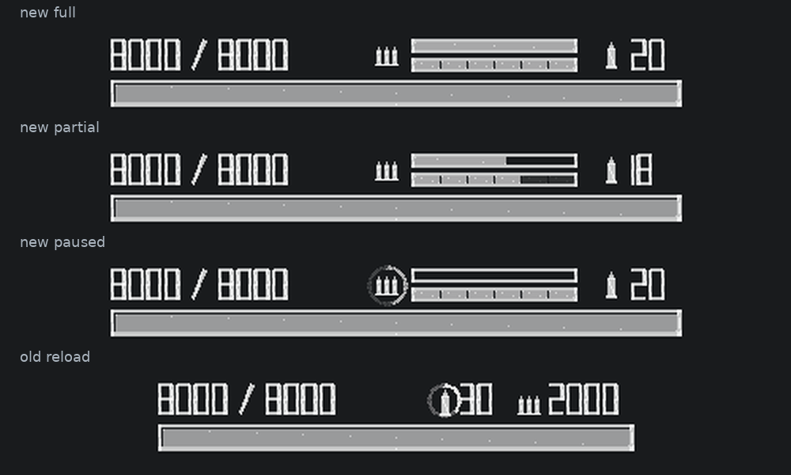
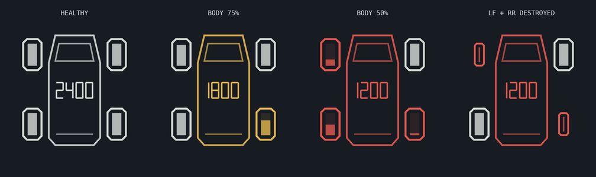

# DRIVER HUD — HD2 载具状态 HUD

一个面向 **《绝地潜兵 2 / Helldivers 2》** 的轻量级载具状态 HUD Mod。它的目标很简单：让载具乘员能及时看清车辆状态，同时不把 HUD 本身变成另一种信息噪音。

**当前版本：1.4.1**  
[English README](README.md) · [Nexus Mods](https://www.nexusmods.com/helldivers2/mods/16358) · [GitHub 最新 Release](https://github.com/FireScallion/DRIVER-HUD---HD2-Vehicle-HUD/releases/latest) · [更新日志](CHANGELOG.md)

DRIVER HUD 目前为两种坦克，以及机枪 FRV / 补给 FRV 提供紧凑的载具状态显示，包括车体生命值、武器弹药、装填状态和轮胎状态等信息，并尽量保持接近游戏原本的视觉语言。

本 MOD **只负责显示状态**，不会修改车辆生命值、伤害、弹药容量、装填规则、操控、武器性能或其他玩法数值。

## DRIVER HUD 想解决什么

项目从一开始就围绕三个目标设计：

- **先显示真正有用的信息。** 战斗中快速判断车辆还能撑多久、武器还有多少弹、轮胎是否损坏，而不是把屏幕做成数据表格。
- **稳定表现优先于虚假的精度。** 多人游戏中的弹药数据如果以跳步形式同步，HUD 会保留最近一次有效状态，而不会为了“数字每一发都连续跳动”进行激进轮询，也不会把一次读取缺失显示成 0。
- **尽量降低额外开销。** 正式运行路径使用有界采样和缓存；开发阶段 Probe 使用过的高频大范围扫描不会进入正常游戏路径。

这一思路在加特林坦克上最明显：当前 300 发弹链使用**条形显示**，而不是每发都高速变化的数字。即使远端炮手的弹药状态以较大的步长同步，条形仍然具有良好的可读性。

## 当前支持载具

| 载具 | HUD 信息 |
| --- | --- |
| **原版堡垒坦克** | 车体生命值、主炮弹药、同轴机枪弹药、主炮装填提示、中央准星 |
| **加特林 / 导弹坦克** | 车体生命值、300 发当前弹链条、6 格备用弹链、两侧导弹合计余弹、加特林装填提示、中央准星 |
| **机枪 FRV** | 车体生命值、四轮独立耐久显示、轮胎损毁后的轮毂状态 |
| **补给 FRV** | 车体生命值、四轮独立耐久显示、轮胎损毁后的轮毂状态 |

### 原版堡垒坦克

- 车体当前 / 最大生命值与生命条。
- 主炮剩余弹药。
- 同轴机枪剩余弹药。
- 主炮满弹为 **31 发（30 + 1）**。
- 主炮装填提示环放在**武器图标左侧**，不会挤占图标和弹药数字之间的空间。
- 屏幕中央载具准星。
- 支持坦克驾驶位与炮手位 HUD 路径。

### 加特林 / 导弹坦克

- 车体当前 / 最大生命值。
- 加特林当前弹链以 **0～300 条形**显示。
- 当前弹链下方显示 **6 格备用弹链**。
- 两套独立导弹架的剩余弹药合计显示。
- 加特林装填提示环位于**武器组左侧**。
- 屏幕中央载具准星。
- 手动装填遵循实际观察到的游戏状态；单纯“弹药归零”不会让 DRIVER HUD 自己假设已经开始自动装填。

加特林 HUD 有意不显示一个每发都高速变化的数字。这里优先考虑视觉稳定性和较低的读取开销，而不是追求没有实际必要的逐发显示精度。



### 机枪 FRV 与补给 FRV

- 车体生命值。
- 四个轮胎分别显示耐久状态。
- 每个轮胎内部使用连续耐久条，不额外堆叠四个轮胎 HP 数字。
- 轮胎完全损毁后切换为轮毂表现。
- 车辆朝前时四轮顺序为 **左前 / 右前 / 左后 / 右后**。
- 如果精确轮胎数据暂时不可用，HUD 会采用保守的降级表现，不凭空制造一个精确数值。
- FRV 车体轮廓与车体 HP 保留现有状态配色：
  - 高于 75%：白色
  - 75% 及以下：黄色
  - 50% 及以下：红色
- FRV HUD 的位置与缩放可以通过游戏外部的简单 TXT 文件实时修改。



## 弹药读数与装填提示

DRIVER HUD 始终把游戏本身的状态作为权威结果。

- 一次读取缺失**不会**被当成 0 弹药。
- 短暂网络空窗会保留最近一次有效弹药状态，不让 HUD 闪 0 或直接消失。
- 变暗并带虚线下划线的弹药条 / 数字代表**最近一次有效读数**，并非刚刚更新的新样本。
- 装填提示由实际观察到的装填状态触发，不会因为 `ammo == 0` 就自行开始。
- 已观察到的中断装填会保留已有进度。
- 重新入座不会让 HUD 自己把暂停中的装填恢复运行。
- 如果进入载具时装填已经进行了一段时间、无法确定准确起点，HUD 会使用静态点状环，不编造一个百分比。
- 装填状态长时间缺失时，显示会保守保持，不会假装武器已经装好。
- 装填环本身绝不会替游戏补弹，也不会自行扣除备用弹链。

## 性能与稳定性

性能是 DRIVER HUD 的核心设计目标之一。

正式运行路径使用有界采样和显示缓存，不会把逆向研究阶段使用过的高频大范围扫描带入正常游戏。新坦克的武器读取共享有限调度，也不会为了让加特林条“每一发都移动一下”而把整套坦克系统提高到 20 Hz 扫描。

坦克静态 HUD 与动态装填环分别缓存，因此装填动画推进时无需每帧重新创建生命条、数字、准星和其他静态元素。

FRV 的 native reader 使用版本限定的内部结构并带有兼容性检查。如果游戏更新后实际布局不再符合当前契约，对应 native 路径会停止使用，而不会继续读取不可信的内存位置。

实现与验证说明见：

- [`docs/PERFORMANCE_说明.txt`](docs/PERFORMANCE_说明.txt)
- [`docs/VALIDATION_1.4.1.md`](docs/VALIDATION_1.4.1.md)

## 前置要求

需要单独安装 **Bingus Shared Loader v15 / API 1**。

- Nexus Mods：https://www.nexusmods.com/helldivers2/mods/16292

在 Arsenal 默认优先级规则下，请把 **Bingus Shared Loader 放在 Mod 列表最底部**，保证它获得最终有效覆盖优先级。

如果启用了 Arsenal 的 **First-Mod Priority**，请按对应的反向排序规则调整，确保 BSL 的最终有效优先级仍然正确。

## 安装

1. 关闭游戏。
2. 禁用或删除所有旧 DRIVER HUD，包括 Resolver / FRV / Tank Probe 测试分支。
3. 将 `DRIVER_HUD_1.4.1.zip` 直接导入 Arsenal，并启用 **Core**。
4. 单独安装并启用 **Bingus Shared Loader v15**。
5. 确认 BSL 的最终有效优先级正确。
6. 执行 **Purge**。
7. 执行 **Deploy**。
8. 启动游戏。

不要同时启用多个 DRIVER HUD 版本或开发探针。

GitHub Release 与 Nexus Main File 可以使用同一个安装 ZIP。

## FRV HUD 位置与大小

1.4.x 已不再需要旧的 CMD / PowerShell 图形配置器。

启用 DRIVER HUD 启动游戏一次后，MOD 会创建：

```text
%APPDATA%\Arrowhead\Helldivers2\frv_hud_position.txt
```

文件中已经包含中英文说明。使用记事本打开并修改：

```ini
x = 0.714
y = 0.900
scale = 1.000
```

- `x`：HUD 中心水平位置（`0 = 最左`，`1 = 最右`）
- `y`：HUD 中心垂直位置（`0 = 顶部`，`1 = 底部`）
- `scale`：FRV HUD 大小（`0.5` ～ `2.0`）

保存后，游戏运行时通常会在约 **2 秒**内读取新位置。

真正使用的配置文件位于 AppData，**不在 MOD ZIP 里**。因此直接把 ZIP 导入 Arsenal 的玩家也能正常修改和保存设置，不需要解压 MOD、不需要在压缩软件里确认更新文件，也不用为了移动 HUD 重新执行 Purge / Deploy 或重启游戏。

首次生成 TXT 时，会自动迁移旧 `frv_hud_position.json` 中有效的设置。TXT 创建后只需编辑 TXT；更新 DRIVER HUD 也不会主动覆盖已经存在的位置配置。

## 其他配置

可选的 `driver_hud.cfg` 位于同一个 AppData 目录，安装 ZIP 中附有模板：

```text
%APPDATA%\Arrowhead\Helldivers2\driver_hud.cfg
```

默认值：

```ini
debug=true
perf=false
offset_y=155
scale=1
alpha=0.76
geometry_numbers=true
```

- `offset_y` — 坦克 HUD 垂直位置
- `scale` — 坦克 HUD 大小
- `alpha` — 两种 HUD 共用的透明度
- `debug` — 诊断日志
- `perf` — 可选性能诊断，主要用于调试
- `geometry_numbers=false` — 恢复原来的数字字体路径，不使用几何数字

修改 `driver_hud.cfg` 后需要重启游戏；FRV 位置 TXT 不需要。

## 常见问题排查

如果 HUD 完全不显示：

1. 确认只启用了一个 DRIVER HUD 版本。
2. 删除旧的 Tank / FRV / Resolver Probe 测试包。
3. 确认 Bingus Shared Loader v15 已启用。
4. 检查 Arsenal 中 BSL 的最终有效优先级。
5. 再执行一次 Purge 和 Deploy。
6. 打开 `driver_hud.log`，确认开头的版本号确实是你刚刚安装的版本。

游戏更新可能改变内部载具 / 网络结构。如果问题恰好从《绝地潜兵 2》更新后开始，请尽量提供更新后的新日志。

## 日志与问题反馈

DRIVER HUD 会保留当前游戏进程和上一次游戏进程的日志：

```text
%APPDATA%\Arrowhead\Helldivers2\driver_hud.log
%APPDATA%\Arrowhead\Helldivers2\driver_hud_previous.log
```

Bingus Shared Loader 日志：

```text
%LOCALAPPDATA%\CowboyBingus\Helldivers2\Logs\BingusSharedLoader.log
```

反馈问题时，请尽量说明：

- DRIVER HUD 版本与游戏版本
- 载具类型
- 驾驶位 / 炮手位 / 乘员位（如果相关）
- 房主或加入者
- 出问题前是否切换过座位或载具
- 当时是否有多辆载具同时活动
- 问题出现前的操作顺序
- 有帮助时附截图或视频
- 完整 DRIVER HUD 日志；日志较大时建议压缩后提供

## 从源码构建

仓库包含可编辑 Lua 模块、稳定的堡垒坦克基线、构建脚本、发布包模板、focused regression tests，以及当前源码快照对应的验证输出。

构建安装 ZIP：

```text
python build.py dist/DRIVER_HUD_1.4.1.zip
```

构建系统会保留 1.2.1 稳定基线中的原版堡垒坦克核心区块，组合当前 runtime / UI 模块，生成二进制 patch payload，并把 `package/` 打包成可直接导入 Arsenal 的 ZIP。

主要目录：

```text
src/tank_runtime.lua        坦克变体识别、武器状态与装填状态
src/tank_ui.lua             坦克 HUD、弹链/备用弹链显示、装填提示层
src/native_reader.lua       版本限定的只读原生载具 / Health reader
src/frv_runtime.lua         FRV 身份、Health 与轮胎状态模型
src/frv_ui.lua              FRV HUD 几何与绘制
src/hud_numbers.lua         共用几何数字绘制
src/position_config.lua     FRV TXT 配置与旧 JSON 迁移
src/integration_update.lua  运行时整合与状态仲裁
src/log_session.lua         每个游戏进程的日志轮转
baseline/                   原版堡垒坦克稳定基线
package/                    发布包模板
package/CORE/               打包后的 patch / GUI material 资源
tests/                      focused 离线回归测试
evidence/                   当前源码快照的验证输出
```

仓库 / 发布包不分发游戏 DLL、进程转储、heap snapshot、第三方加载器、字体文件或 Windows 图形配置器可执行脚本。

## 开发与验证说明

目标运行时是 **LuaJIT**。仓库包含针对坦克状态 / UI、FRV 整合、异常容错、性能调度契约、FRV TXT 配置、日志轮转、Win32 adapter、历史采样回放和安装包结构的 focused tests。

自动回归测试可以防止已经发现的问题重新出现，但无法代替所有实机多人组合，也不能等价于真实游戏 FPS 基准。当前源码快照的实际验证范围见 [`docs/VALIDATION_1.4.1.md`](docs/VALIDATION_1.4.1.md)。

《绝地潜兵 2》更新后，即使 HUD 本身没有变化，也可能需要 DRIVER HUD 重新适配内部结构。

## 1.4.1 版本说明

1.4.1 将已完成实机短验的 1.4.0-HF1 路径正式化：

- 修复首版 1.4.0 测试中 Arsenal 旧身份残留导致坦克 HUD 实际仍加载旧版本的问题
- 保留 1.4.0 新增的加特林 / 导弹坦克 HUD
- 两种坦克的装填提示都保持在**可装填武器图标左侧**
- 保留外部中英双语 FRV TXT 配置
- 保留 1.3.5 的 native 兼容保护、轮胎故障隔离和几何数字绘制路径

完整历史请查看 [`CHANGELOG.md`](CHANGELOG.md)。

## 开源与署名

项目自身拥有权利的源码以 **MIT License** 发布。第三方资源和内容继续遵守其原许可或授权条件，详见 [`CREDITS.txt`](CREDITS.txt)。

主要前置 / 参考鸣谢：

- **CowboyBingus** — Bingus Shared Loader。
- **DDRK1NG** — HD2 HUD+；项目早期 bootstrap / UI 研究的重要参考，保留的相关复用内容已在 `CREDITS.txt` 中单独署名。

Helldivers 2 及其游戏资产、名称、接口与标识符归其各自权利方所有。本项目与 Arrowhead Game Studios 或 Sony Interactive Entertainment 无隶属关系。
